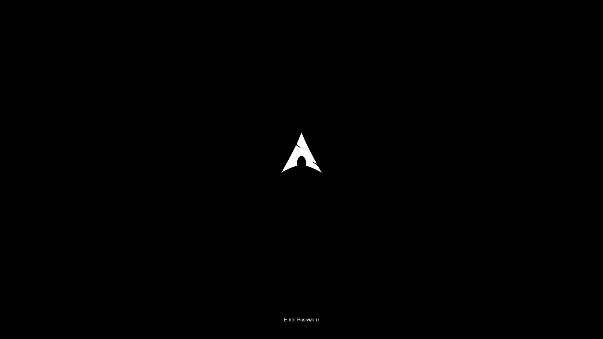

# Monoarch Refined

A refined Plymouth boot theme based on [Monoarch](https://github.com/farsil/monoarch) - featuring centered layout, responsive design, and a clean password prompt that works across all display types.


## Features

- **Centered Layout** - Logo and spinner perfectly centered with proportional spacing
- **Universal Display Support** - Responsive design adapts to all screen resolutions and aspect ratios
- **Clean Password Prompt** - Minimalist Connect-style bullet input
- **Monochrome Design** - Clean black and white Arch Linux aesthetic
- **Smooth Animations** - Elegant spinner animation and pulsating logo effects

## Modifications from Original

- Centered logo and spinner layout with proportional spacing (5% and 3% of screen height)
- Replaced complex dialog box password prompt with simple bullet-style input
- Added responsive design that scales across different display types
- Optimized for modern displays (1080p, 1440p, 4K, ultrawide, etc.)

## Requirements

- Plymouth
- Arch Linux (or Arch-based distribution)
- No specific font dependencies (uses system default)

Optional for best appearance:
- `cantarell-fonts` or `ttf-dejavu`

## Installation

⚠️ **Warning**: If you haven't installed and set up plymouth. Please [Click here](https://wiki.archlinux.org/title/Plymouth) and follow the arch wiki guide to setup before proceeding further.

### Manual Installation

1. Clone the repository:
```bash
git clone https://github.com/iam-vasanth/monoarch-refined.git
cd monoarch-refined
```

2. Copy the theme to Plymouth themes directory:
```bash
sudo cp -r monoarch-refined /usr/share/plymouth/themes/
```

3. Set as default theme:
```bash
sudo plymouth-set-default-theme monoarch-refined
```

4. Rebuild initramfs:
```bash
sudo mkinitcpio -P
```

5. Reboot to see the theme in action!

### Testing Before Reboot (Optional)

For testing purposes, I have included a test script that shows the splash screen for 10 seconds, then the password prompt for 10 seconds, and automatically closes.

⚠️ **Warning**: Do not try to close the terminal or Plymouth window abruptly before the timer ends. If interrupted, the boot splash may get stuck and you will need to manually kill the process or reboot. Please wait for the script to complete by itself.

In the same `monoarch-refined` directory:
```bash
chmod +x test-plymouth.sh
./test-plymouth.sh

If needed, you can edit the script file to test any Plymouth theme installed in `/usr/share/plymouth/themes/` and change the timer durations as well.

**Tip**: Edit the script to customize:
- `THEME_NAME` - Test any theme from `/usr/share/plymouth/themes/`
- `SPLASH_DURATION` and `PASSWORD_DURATION` - Adjust timers as needed (Recommended in Seconds)

## Uninstallation

1. Switch to another theme:
```bash
sudo plymouth-set-default-theme -R
```

2. Remove the theme:
```bash
sudo rm -rf /usr/share/plymouth/themes/monoarch-refined
```

3. Rebuild initramfs:
```bash
sudo mkinitcpio -P
```

## Display Compatibility

This theme is designed to work seamlessly across:
- Standard displays (16:9, 16:10, 4:3)
- Ultrawide monitors (21:9, 32:9)
- All resolutions (720p, 1080p, 1440p, 4K, 8K)
- HiDPI/Retina displays
- Portrait/vertical displays

The proportional spacing ensures consistent appearance regardless of screen size or aspect ratio.

## Screenshots

### Boot Animation


### Password Prompt


## Credits

- **Original Theme**: [Monoarch](https://github.com/farsil/monoarch) by Marco Buzzanca 
- **Modified by**: [iam-vasanth](https://github.com/iam-vasanth) (2025)

## License

MIT License - See [LICENSE](LICENSE) file for details

Copyright (c) 2016 Marco Buzzanca  
Modifications Copyright (c) 2025 iam-vasanth
 
## Contributing

Contributions are welcome! Feel free to:
- Report bugs
- Suggest improvements
- Submit pull requests

---

**Note**: If you encounter any issues, please check the [Issues](https://github.com/iam-vasanth/monoarch-refined/issues) page or create a new one. I'll do my best to help!